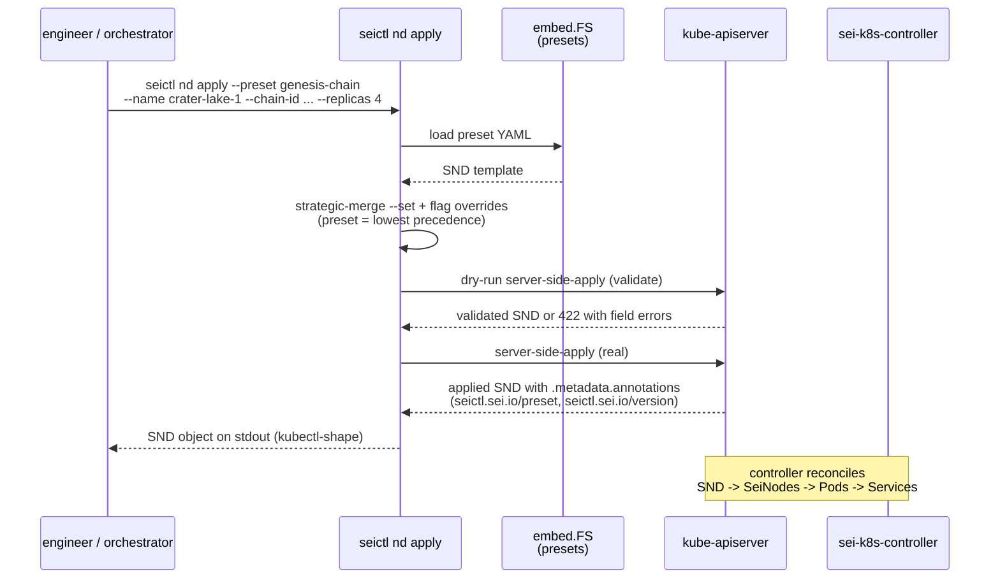
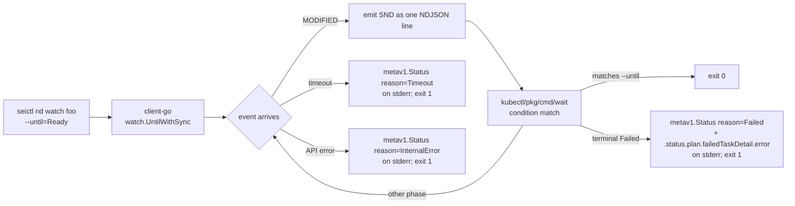

# `seictl nodedeployment` CLI

## Background

PR #133 deleted ~9.4k LOC of `cluster/` higher-order verbs (`chain up/down`, `rpc up/down`, `bench up/down/list`, `onboard`, `context`, `per-pod`). Those verbs abstracted away the underlying `SeiNodeDeployment` CRD into pseudo-custom resources that aren't real CRDs and added complexity beyond their ergonomic payoff. The previous design (`docs/design/cluster-cli.md`) covered that surface; this design supersedes it.

Brandon's intent:

> Remove higher-order commands from seictl and just provide the basic building blocks for SeiNode and SeiNodeDeployments. The interface looks like `seictl nodedeployment --preset genesis-chain --chain-id crater-lake-1`. A primary goal of the higher-order commands was ergonomics — the preset convention will be enough to make this composable without turning the interface into parameter soup. Implement basics: list, watch, status.

A coral design pass on 2026-05-05 (kubernetes-specialist + product-engineer) produced the v1 surface. A mid-stream course-correction landed on output shape: an initial `seictl.sei.io/v1` envelope wrapping CR data in `data.*` was rejected after a quick external check across kubectl, argocd, istioctl, linkerd, and flux. Every K8s CLI returns the native CR shape; envelopes are reserved for tools wrapping non-CR concepts (helm releases, terraform state). Errors follow the K8s API convention via `metav1.Status`.

## Goals

- Thin imperative CLI over `seinodedeployments.sei.io`. Engineers shell `seictl nd ...` instead of hand-rolling SND YAML.
- Preset-driven sane defaults so the common cases (fresh chain, RPC fleet) collapse to one flag.
- K8s-native output shape — tools that consume seictl output should treat it like `kubectl get snd -o json`. Zero new envelope shape to learn.
- `watch` verb subsumes `kubectl wait --for=jsonpath=...` for orchestrator scripts.
- Replaces enough of the deleted `cluster/` surface to unblock the nightly release-test orchestrator's rewrite.

## Non-goals (with un-defer triggers)

- **`seictl node` (SeiNode CLI).** Defer until an engineer reaches for bare SeiNode management without an SND wrapper. v1 is `nodedeployment` only.
- **Multi-preset overlay** (`--preset a --preset b`) and **composite presets** (`genesis-chain-evm`). Atomic preset + `--set k.v.path=value` overrides only.
- **Custom envelope output shape.** Native CR shape only.
- **Remote preset distribution / preset versioning lockfile / preset-of-presets templating.** Embedded presets in the binary; seictl version IS the preset version.
- **Onboarding workflow inside seictl.** Already deleted in #133; staying out. Onboarding moves to platform repo + sei-engineer-workspaces repo.
- **Cosmos crypto / key generation in seictl.** Closed via seictl#127 (won't fix; belongs in seid).

## Design

### Verbs (5 for v1)

| Verb | Behavior |
|---|---|
| `seictl nd apply --preset <name> --name <n> [--chain-id ...] [--image ...] [--replicas N] [--set k.v=val] [--dry-run]` | Render preset + overrides, server-side-apply, return post-apply CR. Default-applies; `--dry-run` returns the would-be-applied CR without mutation. |
| `seictl nd get <name>` | Returns the SND exactly as `kubectl get snd <name>` would. Same `-o json|yaml|name|jsonpath=...` flag set. |
| `seictl nd list` | Returns `SeiNodeDeploymentList`. Filtering: `-l label-selector=...`, `-A` for all namespaces. |
| `seictl nd delete <name> [--cascade=foreground]` | kubectl-style delete. Respects `spec.deletionPolicy` already on SND. |
| `seictl nd watch <name> [--until=Ready] [--timeout=15m]` | NDJSON stream of `SeiNodeDeployment` objects on each event; exit codes carry terminal verdict. Subsumes `kubectl wait --for=jsonpath=...`. |

Short alias: `seictl nd ...` (with `n` reserved for future `seictl node`).

### Apply flow

### Watch flow

### Implementation: build on existing libraries

Each verb is glue around existing K8s ecosystem libraries — no hand-rolled watch, apply, condition-matching, or jsonpath logic.

| Verb | Library |
|---|---|
| `apply` | `sigs.k8s.io/controller-runtime/pkg/client.Patch` with `client.Apply` (server-side-apply, dry-run via `client.DryRunAll`). |
| `get` / `list` / `delete` | `sigs.k8s.io/controller-runtime/pkg/client` typed client over the SND scheme. |
| `watch` | `k8s.io/client-go/tools/watch.UntilWithSync` for the watch + informer + reconnect machinery; `k8s.io/kubectl/pkg/cmd/wait` for `--until=...` condition evaluation. |
| Output formatting (`-o json/yaml/jsonpath/name`) | `k8s.io/cli-runtime/pkg/printers`. |
| Error wrapping into `metav1.Status` | `k8s.io/apimachinery/pkg/api/errors` (`NewInternalError`, `NewTimeoutError`, etc.). |

### Preset taxonomy (2 for v1)

- **`genesis-chain`** — SND with `spec.genesis` shape and N validator replicas. `--chain-id` is required (preset has no hardcoded chain ID; chain ID is a parameter of the preset, not part of it). Validator identities are generated by the chain at genesis — no key parameter needed. Replaces the deleted `chain up`. Live consumer: nightly release-test orchestrator.
- **`rpc`** — SND with `spec.template.spec.fullNode: {}` + state-sync-by-default + `peers[]` selector to a chain. Replaces the deleted `rpc up`. Live consumer: nightly release-test orchestrator.

Cut from v1 (with un-defer triggers):

| Preset | Defer reason | Un-defer trigger |
|---|---|---|
| `archive` | Today only Flux-managed hand-rolled manifests (`prod/protocol/*/archive.yaml`). No imperative consumer. | First script that needs `seictl nd apply --preset archive`. |
| `state-sync-fullnode` | Merged into `rpc` — most fullnodes today are state-sync-by-default. | RPC-without-state-sync becomes a real shape. |
| `fork-genesis` | Wraps the `sei-k8s-controller` fork-genesis feature (in development upstream). Preset is too early to write. Tracked separately in its own issue. | Controller-side fork-genesis lands and stabilizes. |
| `validator` (single SeiNode) | Belongs to deferred `seictl node`. | When `seictl node` ships. |

### Preset distribution

Embedded `embed.FS` in the seictl binary. Same pattern as the deleted `cluster/templates/`. Binary version IS the preset version. No remote, no file-search-path for v1.

Un-defer file-based override (`--preset-dir` flag with embedded fallback) when a non-platform engineer needs to A/B a preset variant without a release.

### Composition

Atomic preset + `--set k.v.path=value` strategic-merge overrides on the SND spec. Maps merge per-key, lists replace wholesale. Lowest-precedence: preset's full spec. Highest-precedence: discrete CLI flags + `--set`. Server-side-apply dry-run after merge is the validation oracle (cluster's API server is the schema authority; no client-side validation reimplementation).

### Output

| Surface | Shape |
|---|---|
| Success (single) | Native `SeiNodeDeployment` — identical to `kubectl get -o json`. |
| Success (list) | `SeiNodeDeploymentList`. |
| Watch | NDJSON of `SeiNodeDeployment` objects, one per line. Last line carries terminal phase. |
| Error | `metav1.Status` object on stderr (`kind: Status, apiVersion: v1, status: Failure, reason, message, code, details`). Exit code `1`. |
| Provenance | Annotations on the CR: `seictl.sei.io/preset: <name>`, `seictl.sei.io/version: <semver>`. Surfaced naturally by `kubectl get -o yaml`. |

#### Exit codes

Follow `kubectl` / `kubectl wait` convention: `0` on success, `1` on anything else. Discrimination among failure modes lives on stderr in the `metav1.Status` object (the `.reason` field — e.g. `Timeout`, `Failed`, `InternalError`, `Forbidden`, `Invalid`). Orchestrator scripts that need to retry transients vs. fail-fast on terminal phases parse `.reason`, not exit code.

| Code | Meaning |
|---|---|
| 0 | Success — apply/get/list/delete completed; watch reached `--until` phase. |
| 1 | Any failure — usage, validation rejection, terminal `Failed` phase, transient API error, watch timeout, etc. `metav1.Status` on stderr carries the reason. |

### Endpoint synthesis

Consumers need composed URLs (e.g. `http://chain-rpc.nightly.svc:26657`). The data today lives at `.status.internalService` + `.status.perPodServices[]` as service handles, not URLs.

**v1 stance: block on the upstream fix; seictl does not synthesize URLs client-side.** `sei-protocol/sei-k8s-controller#171` tracks adding `.status.endpoints.{tendermintRpc, tendermintRest, evmJsonRpc, evmWs}` to the SND. Once that lands, `kubectl get snd -o jsonpath='{.status.endpoints.evmJsonRpc[0]}'` works with no CLI in the loop.

Until then, consumers that need URLs (seiload, the QA mocha harness, the nightly release-test orchestrator) glue them from `.status.internalService` themselves — same as today. seictl emits the SND as-is; we don't carry a temporary client-side overlay that would drift from the upstream shape.

## Alternatives

- **Envelope-wrapped output (`seictl.sei.io/v1` with `data.*` fields).** Rejected. External research across kubectl, argocd, istioctl, linkerd, flux confirmed the K8s-native CR shape is the universal convention. Envelopes are reserved for tools wrapping non-CR concepts (helm releases, terraform state). seictl is wrapping a real CRD; native shape applies.
- **Multi-preset overlay (`--preset a --preset b`).** Rejected. Needs merge semantics doc, conflict resolution, ordering rules — that's the parameter-soup we're escaping.
- **Composite presets (`genesis-chain-evm`).** Rejected. Multiplies cardinality (`{genesis,rpc} × {evm,no-evm} × {archive,full}` → bloat).
- **Remote preset distribution.** Rejected. Supply-chain surface, offline breaks, version ambiguity. Embedded presets have none of these costs and rev-lock with the consumer's binary.
- **`status` as separate verb.** Rejected. `get` returns the same data shape with phase already.
- **`render` verb for dry-render.** Rejected. `apply --dry-run` covers it.
- **`describe` / `logs`.** Rejected. kubectl already does these; layering smell to wrap them.

## Trade-offs

- **Embedded presets means a preset change requires a seictl release.** Acceptable — presets are opinionated defaults that *should* be rev-locked with the binary that consumes them.
- **Native CR shape commits us to the K8s shape contract.** Any breaking change to `SeiNodeDeployment` CRD propagates to seictl consumers. Acceptable — they would break anyway via direct kubectl use; not seictl's job to insulate.
- **`apply` defaults to applying (not dry-run).** Engineer typo `seictl nd apply --preset genesis-chain` could spin up a real chain. Mitigation: `--dry-run` is the ergonomic flag; apply-by-default matches the kubectl convention engineers already know.

## References

- `sei-protocol/seictl#133` — the `cluster/` teardown that triggered this design.
- `sei-protocol/seictl#127` — closed won't-fix; cosmos crypto belongs in seid.
- `sei-protocol/Tide#25` — umbrella architectural synopsis; this design supersedes its seictl-side content.
- `docs/design/cluster-cli.md` — the prior design that this supersedes.
- Brandon's design intent message to his manager (2026-05-04).
- Industry conventions:
  - [kubectl JSONPath docs](https://kubernetes.io/docs/reference/kubectl/jsonpath/)
  - [argocd app get reference](https://argo-cd.readthedocs.io/en/stable/user-guide/commands/argocd_app_get/)
  - [istioctl reference](https://istio.io/latest/docs/reference/commands/istioctl/)
  - [Linkerd CLI output formats](https://github.com/linkerd/website/blob/main/linkerd.io/data/cli.yaml)
  - [K8s `metav1.Status` apimachinery errors](https://pkg.go.dev/k8s.io/apimachinery/pkg/api/errors)
  - [Flux CLI YAML-first output discussion](https://github.com/fluxcd/flux2/discussions/1904)
